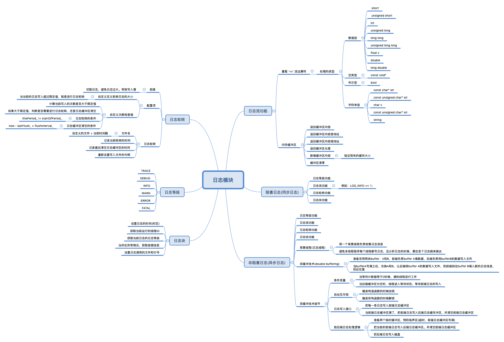

# Logger
- [项目来源](https://github.com/Apriluestc/web.d)
- 功能介绍
  - 多线程异步日志需要线程安全保证，即多个线程可以写日志文件而不发生错乱
  - 简单的线程安全并不难办到，用一个额全局的Mutex对日志的IO操作进行保护或单独写一个日志文件即可，但是前者会造成多个线程竞争锁资源，后者会造成某个业务线程阻塞
  - 解决方案
    - 用一个背景线程负责手机日志消息后将其写入后端，其他业务线程只负责生成日志并将其传输到日志线程
  - 实现
    - 应用双缓冲区技术，即存在两个Buffer，日志的实现分为前端和后端
    - 前端负责向CurrentBuffer中写，后弹负责将其写入文件中
    - 具体来说，当CurrentBuffer写满时，先讲CurrentBuffer中的消息存入Buffer中，再交换CurrentBuffer和NextBuffer
    - 这样前端日志就可以继续往CurrentBuffer中写入新的日志消息，最后再调用notify_all通知后端将其写入文件
  - 功能图
    - 
